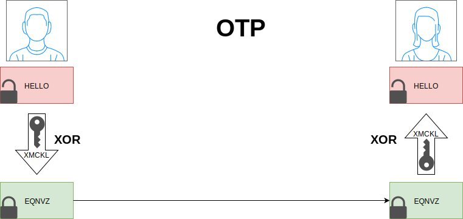

# One time pad

Le *One Time Pad* (OTP) aussi appelé *masque jetable* est une technique simple mais sûr.

A ne pas confondre avec le One Time Password.

## Concepte

L'OTP est une technique de cryptographie qui ne peut pas être cassée mais qui requiert l'utilisation d'une clé partagée à utilisation unique de la même longueur que le message à envoyer.

La clé est aussi appelée *pad* ou *masque*.

Chaque bit/octet du message est chiffré en le combinant avec le bit/octet correspondant de la clé secrète (*one-time pad*) en utilisation l'addition modulaire (*A + B mod C*).

### Exemple

+ Message : taille **n** octet
+ Pad : taille **n** octet aléatoire
+ Alphabet : taille **x**
+ Chiffrement : `(message + clé) mod 26`
+ Déchiffrement : `(message - clé) mod 26`



Chiffrement :

```
07 (H)  04 (E)  11 (L)  11 (L)  14 (O)  message
+
23 (X)  12 (M)  02 (C)  10 (K)  11 (L)  clé
=
30      16      13      21      25      message + clé
=
04 (E)  16 (Q)  13 (N)  21 (V)  25 (Z)  (message + clé) mod 26
```

Déchiffrement :

```
004 (E) 16 (Q)  13 (N)  21 (V)  25 (Z)  texte chiffré
-
023 (X) 12 (M)  02 (C)  10 (K)  11 (L)  clé
=
-19     4       11      11      14      texte chiffré - clé
=
007 (H) 04 (E)  11 (L)  11 (L)  14 (O)  message
```

### Tentative de Cryptanalyse

+ Texte chiffré : `EQNVZ`
+ Clé n°1 : `XMCKL` -> message n°1 : `HELLO`
+ Clé n°2 : `TQURI` -> message n°2 : `LATER`

Si un attaquant possède un temps infini et qu'il peut essayer toutes les combinaisons de clé possibles, il sera en mesure de trouvé plusieurs clés avec un message plausible.

En fait, il est possible de décrypté tous les messages possible avec le même nombre de caractères, mais il n'y a aucune information dans le texte permettant de choisir le bon message.

Dès que le message est grand, la clé étant de même taille, il devient impossible de tester toutes les possibilités (ex: clé de 50Mo), et le nombre de texte possible devient aussi démesurément grand.

## Sécurité parfaite

Le one-time pad est le seul chiffrement respectant les critères de sécurité inconditionnelle (un attaquant ne peut pas obtenir d'information sur le texte clair à partir du texte chiffré et donc l'algorithme est incassable par Cryptanalyse).

La sécurité d'OPT est parfaite car pour une clé donnée, parfaitement aléatoire et utilisée seulement une fois, le message chiffré peut être traduit en tous les messages chiffrés de même taille, et ils sont tous équiprobable.

La probabilité qu'une message en clair soit le bon est égale à la probabilité qu'un message en clair soit le bon étant donné le message chiffré.

Cela peut être écrit:
+ `H(M) = H(M|C)`
+ `H(M)` : entropie
+ `H(M|C)` : entropie conditionnelle

Les algorithmes de chiffrement symétriques utilisent des combinaisons de substitutions et de transpositions. Pour les meilleurs d'entre eux, on ne sait pas si il existe un moyen cryptographique de faire l'inverse de ces procédés sans connaître la clé utilisée.

Les algorithmes de chiffrement asymétriques dépendent des problèmes mathématiques difficiles à résoudre comme la factorisation d'entier ou les logarithmes discrets. Cependant il n'y a pas de preuve que ces problèmes sont dur, et une avancée mathématique (comme les mathématiques quantiques) pourrait rendre le système vulnérable.

## Histoire

D'abord décrit par Frank Miler en 1882 pour sécuriser le télégraphe, l'OTP a été ré-inventé en 1917. Le 22 juillet 1919, un brevet états-uniens a été déposé apr Gilbert Vernam sur l'opération XOR utilisée pour le chiffrement d'OTP.

L'OTP est un dérivé du chiffrement de Vernam mais la forme originelle du chiffrement de Vernam était vulnérable car la clé était répétée en boucle.

Le mot *pad* vient des premières implémentations où le support des clés était des bloc-notes (*pad of paper*).

## Problèmes

### Distribution des clefs

### Authentification

One-time-pad ne propose pas de service d'authentification.
Des méthodes d'authentification classiques peuvent êtres utilisées en plus de one-time-pad:

- MAC: Code d'authentification de message (Semblable au hash du message (message + clef secrète)
- Hashage classique
- Russian copulation (Ré-arrangement de message)

Cependant ces techniques d'authentification ne dispose pas de la qualité d'être parfaitement sûres comme one-time pad.

### Véritable aléa

## Cas d'utilisations

### Applicabilité

### Utilisations historiques

One-time-pad est connu pour avoir été utilisé, depuis les années 1900, pour les communications spéciales des états:

- Pour les échanges diplomatiques (Dès 1923 en Allemagne, Téléphone rouge Washington-Moscou)
- Par les services secrets (agents secrets)
- Par les forces spéciales
- Implémenté sous forme de machines à ruban perforés (notamment durant la seconde guerre mondiale)


### Exploitations

+ Many Time Pad Attack – Crib Drag

## Sources

+ [Wikipedia One-time pad](https://en.wikipedia.org/wiki/One-time_pad)
+ [Wikipedia Information-theoric security](https://en.wikipedia.org/wiki/Information-theoretic_security)
+ [Wikipedia Entropy](https://en.wikipedia.org/wiki/Entropy_(information_theory))
+ [Wikipedia Conditional entropy](https://en.wikipedia.org/wiki/Conditional_entropy)
+ [Wikipedia Authentication](https://en.wikipedia.org/wiki/Authentication)
+ [Wikipedia Russian copulation](https://en.wikipedia.org/wiki/Russian_copulation)
+ [Wikipedia Universal hashing](https://en.wikipedia.org/wiki/Universal_hashing)
